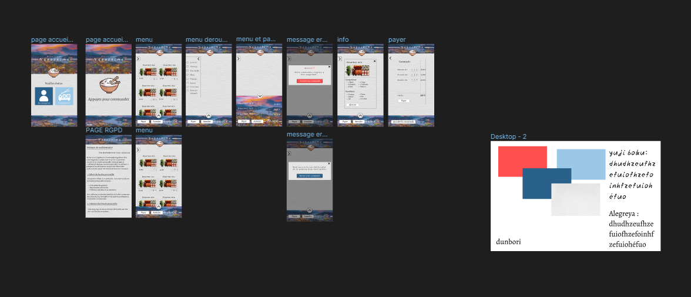

# SAE 401

Bienvenu(e) sur le Readme de notre site. Ici bas vous trouverez tous les livrables qu'on a effectué tout au long de la SAE, qui consistait à créer une borne ou application de commande de sushis. Moi et 3 autres membres du groupe, on s'est divisé les tâches afin d'avoir un environnement de travail dynamique. Ce dépôt concerne la partie Front du site, en appuyen sur le [lien](https://github.com/RubenDavidAbreu/REST-API), vous serez redirigés vers le dépôt du déveoppement de notre API REST !

# Les membres de notre groupe !

**Ruben :**
En tant que chef de groupe, il se devait d'entretenir au bon déroulement du projet et des relations entre les membres. Il s'est occupé de la partie Front (CSS principalement) du site et la partie Back (80% de l'API REST).

**Morgane :**
Cette membre s'est occupée de la partie Design du site, dont la création de la maquette (couleurs et police d'écriture) et du logo. Elle a aussi veillée, au fur et à mesure, que les développeurs respectaient la maquette. 

**Jérémie :**
Ce membre s'est essentiellement concentré sur la partie front, plus particulièrement de la récupération des données de l'API pour pouvoir les afficher. Il a tout de même contribué à la parti Back et surtout à la création de la base de données.

**Arno :**
Ce membre s'est aussi concentré sur la partie front, dans la création site. Vu que nous avons utilisé Angular pour le front, il fallait créer les composants et services nécessaires pour faire fonctionner le site. Il a aussi collaboré sur la partie back ainsi qu'au niveau du CSS.

# Livrables

Cette partie concerne nos livrables. Dans chaque livrable, sous les tâches, des noms sont inscrits, donc ils devront les tâches qui leurs seront attribués 

<h2 style="color: blue;">L401_1</h2>

**Nom et logo de l’application :**
- Nom: Nagashima

**Analyse des besoins (Use case) :**
- Arno
  

**Diagramme de collaboration :**
- Ruben (en cours)

**Conceptualisation de la BDD (diagramme de classes) :**
- Jérémie (en cours)

**Schéma de la BDD:**

**Architecture fonctionnelle de l’application :**
- A définir (en cours)

**Rédaction README :**
- Ruben (en cours)

<h2 style="color: blue;">L401_2</h2>

**Création de l’API :**
- Tous les membres du groupe (en cours)

**Architecture de l’implémentation :**
- Tous les membres du groupes (en cours)

<h2 style="color: blue;">L401_3</h2>

**Maquette de l’application :**
- Morgane

Voici le lien vers notre maquette [Figma](https://www.figma.com/file/js3IPJ5lyDuOkkbZxPp5JI/SAE-401---Sushi?type=design&node-id=0-1&mode=design&t=OsKSFu5Ozi29BfzR-0)

<h2 style="color: blue;">L401_4</h2>

**Intégralité code, partie Front :**
- Lien du GitHub : (en cours)

<h2 style="color: blue;">L401_5</h2>

**Compte rendu des tests unitaires effectués :**
- Optionnel

**Page RGPD :**
- Front : Jérémie
- Ecriture : Morgane

